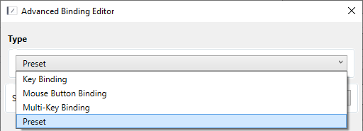
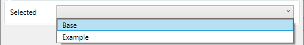

## Preset.Binding

A plugin for OpenTabletDriver that allows you to bind keys to presets.

### How to use

1. Install the plugin
2. Open any tab where you can change bindings
3. Click on the 3 dots [...] next to the binding you want to change

    

4. Select `Preset` in Type

    

5. Select the preset you want to bind in Selected

    

6. Click on `Save` & `Apply` to save the changes, and it will work, as tested on 4 different versions of OTD, including 0.6.4.0.

### Known issues

The UX get out of sync when applying presets externally, it is only a visual issue, the preset is applied properly
Looking into a fix for this.